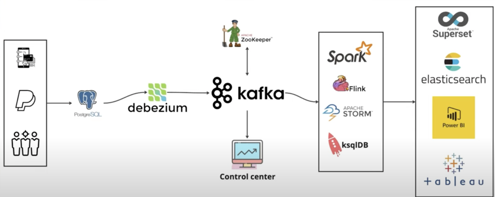

# Realtime-Change-Data-Capture-Streaming


## System Architecture



## How to Run and Test the CDC Platform


- Start the Services
```bash
docker-compose up -d
```

- Run the SQL Script (This allow to capture CDC for some amount in more details)

```bash
docker-compose exec postgres psql -U postgres -d financial_db -f ./docker-entrypoint-initdb.d/script.sql
```

- Create the Connector

```bash
chmod +x connector.sh
./connector.sh
```

