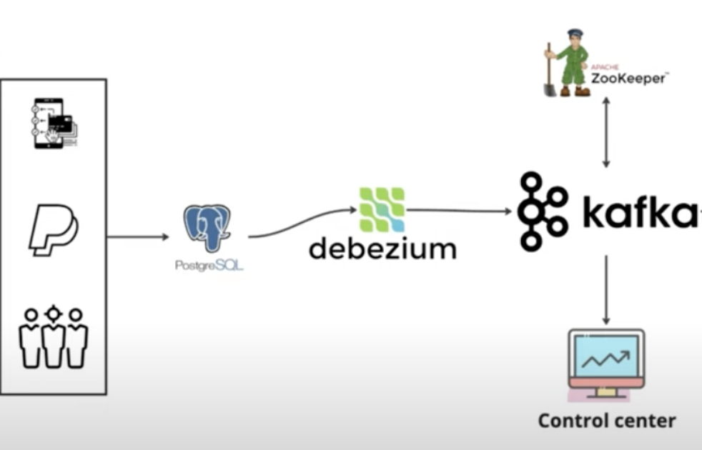
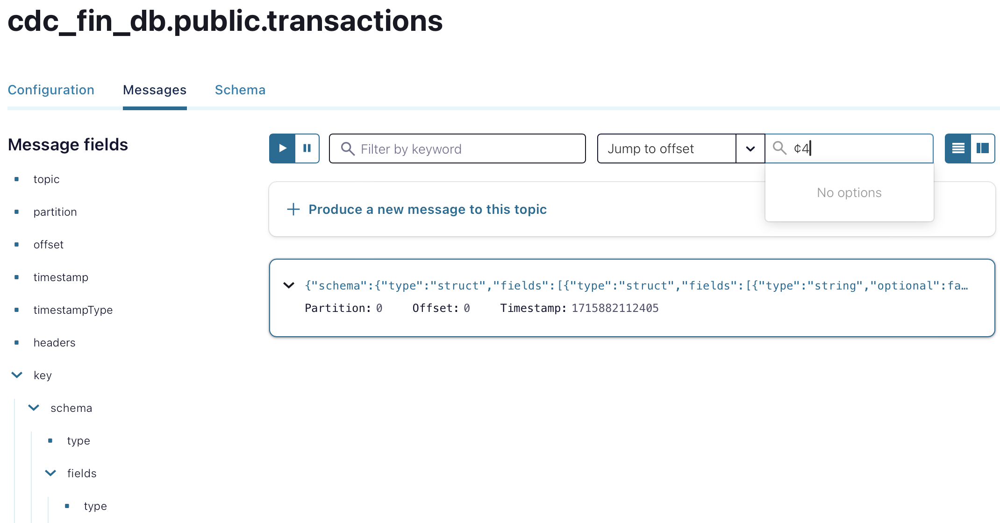

# Realtime-Change-Data-Capture-Streaming


## System Architecture



## How to Run and Test the CDC Platform

- Start the Services
```bash
docker-compose up -d
```

- Run the SQL Script (This allow to capture CDC for some amount in more details)

```bash
docker-compose exec postgres psql -U postgres -d financial_db -f ./script.sql
```

- Create the Connector

```bash
chmod +x connector.sh && ./connector.sh
```

- Push Data to DB

```bash
conda create --name cdc_platform python=3.9.19 && source $(conda info --base)/etc/profile.d/conda.sh && conda activate cdc_platform && pip install psycopg2-binary faker && python main.py

```

- View the CDC Messages on http://localhost:9021 (Control Center)



